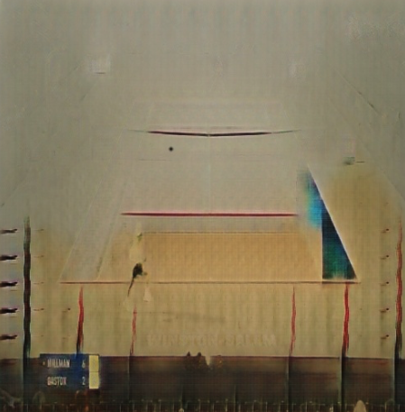

# Domain Transfer for Object Detection Models  
**Final Report for [CS 152 L3D at Tufts in Fall '24](https://www.cs.tufts.edu/cs/152L3D/2024f)**  
**Instructors can share this report to future students of similar classes**  
Oliver Eielson and Youssef Ezzo

---

## Introduction

Object detection is a widespread problem in machine learning. It is a complex task that can have many applications. Recently, there has been a significant increase in the use of machine learning to perform data analytics on real-world sports games. Some sports that have successfully implemented AI into their data analytics include football, soccer, tennis, and many others. Something many of these sports have in common is that all of them are popular sports, with an abundance of labeled data associated with them, but what happens when attempting to build a tool like this for a more niche sport where labeled data is not as easy to find? This paper aims to find an answer to this question. Using squash as the target sport, this paper attempts to train an object detection model to track a squash ball, a step that would be crucial to building any AI data analytics tool for the sport.

To address this challenge, this paper investigates domain transfer techniques to overcome data scarcity. Domain transfer is a process where data from a source domain (e.g., tennis) is transformed to align with the target domain (e.g., squash), making it usable for model training. Tennis, a visually and semantically similar sport, offers extensive labeled datasets that can be leveraged to augment the limited squash data. This augmentation is achieved through two key methods:

1. **Color Segmentation**: A rule-based approach that alters tennis images by changing the court’s color to resemble a squash court, modifying line colors to red, and recoloring the ball to black.  
2. **CycleGAN**: An advanced domain transfer method that generates realistic synthetic squash images from tennis images using unpaired image-to-image translation while preserving spatial consistency.

The critical advantage of these methods is that they preserve the ground-truth annotations (e.g., ball bounding boxes) while transforming the images. This allows the creation of a larger, more diverse training dataset without requiring costly manual labeling.

To evaluate the effectiveness of domain transfer, we train a Faster R-CNN object detection model [@ren2016fasterrcnnrealtimeobject] to take a squash match and output a bounding box prediction to identify the ball within the frame. The model’s performance is measured using standard object detection metrics, including mAP@[0.5] and mAP@[0.5:0.95].

It is expected that training the model on the dataset enhanced with images from CycleGAN to outperform using the dataset enhanced with color-altered images. Additionally, we believe both methods will outperform a model trained only on our squash dataset. This is because tennis and squash are domains which are similar enough, especially when looking at the players, rackets, and ball, that after making minor adjustments to the tennis dataset, the transformed data will improve the accuracy of the model. Both methods will provide a larger dataset for training; however, the synthetic data generated by CycleGAN is expected to closely resemble real squash images, which is why this method is anticipated to yield the best performance.

---

## Methods

### CycleGAN

One method developed for domain transfer was CycleGAN. CycleGAN [@zhu2020unpairedimagetoimagetranslationusing] is a state-of-the-art unpaired image-to-image translation model. This approach is particularly well suited for our task as it enables the transformation of images from one domain (e.g., tennis) to another (e.g., squash) without requiring paired datasets, which are often unavailable in real-world scenarios. Furthermore, CycleGAN preserves the spatial layout of the image, meaning that the subject in one domain remains in the exact location in the translated domain. This characteristic allows the labels from one domain to be directly mapped onto the other. Without this key trait, CycleGAN would be unsuitable for domain transfer.

<div style="text-align: center;">


</div>

**Figure 1**: Comparison of Input and Output Images for CycleGAN

---

#### CycleGAN Data

To train CycleGAN, a dataset of 3,184 images was created, evenly split between two domains: domain A (tennis) and domain B (squash). A total of 200 images from each domain were withheld for the testing set. The 1,392 tennis images were labeled samples from the Roboflow dataset [@tennis-tracker-duufq_dataset], while the squash images were sourced separately and did not overlap with the training, testing, or validation sets. As these images were unlabeled, they could be gathered in under an hour by downloading publicly available squash images from Google, making this approach accessible and scalable for other researchers. Furthermore, any potential data leakage was avoided by using two distinct sets of squash data for training Faster R-CNN and CycleGAN. Random horizontal flips, crops, and jittering were applied during training to increase data variation.

---

#### Training CycleGAN

The CycleGAN model was trained using the TensorFlow CycleGAN API [@tensorflow_cyclegan] on Google Colab. Due to the high computational cost of training CycleGAN, no grid search or hyperparameter tuning was performed. The model was trained on a Google Colab NVIDIA A100 GPU for 175 epochs. Training was observed to be relatively unstable, with some runs failing and producing random noise. Each training run required approximately 2–3 hours to complete.

---

#### Creating Synthetic Images

Once the CycleGAN model was trained, it was saved and downloaded from Google Colab. Due to the computational expense of CycleGAN inference (1–2 seconds per image), synthetic images were pre-generated before training Faster R-CNN, unlike the on-the-fly generation used with color segmentation. The same 1,392 tennis images used to train CycleGAN were used to generate synthetic squash images. Data leakage was not a concern because the synthetic images were outside the target domain, and the squash images used during CycleGAN training were unseen during Faster R-CNN training. Each tennis image was cropped to 512×512 to generate synthetic images and passed through the trained CycleGAN model. During testing, it was noted that CycleGAN occasionally failed to transfer the ball into the output image due to the ball's small size. A preprocessing step was added to address this issue: a black circle was placed at the ball’s labeled location, followed by applying a Gaussian blur to the area. This adjustment significantly improved the output quality, producing results indistinguishable from images where CycleGAN correctly mapped the ball.

Finally, the annotations for the synthetic images were updated to change the label from “Tennis” to “Squash.” The images and corresponding annotations were saved in a separate folder to avoid accidental mixing with training data.

---

### Color Segmentation

The second method used was color segmentation. This method worked by leveraging OpenCV to take the tennis image and change only the colors in the image to match the color of a squash court. The white lines in tennis were changed to the red lines seen in squash, the floor was changed to match the appearance and texture of a hardwood floor, and most importantly, the ball was changed from yellow to black to look like a squash ball. This method is well suited for the target task because squash and tennis share a lot of the same semantic details, i.e. ball, racket, and player, with the differences, especially once zoomed in, mainly being the shape and color of the objects. To create the segmented dataset, the transformations were broken up into the following steps:

#### Image Crop

Before applying any color transformations to the image, an 80% crop was applied to eliminate some of the noise in the transformation. The main artifacts eliminated by this crop were stands, the crowd, and the umpire chair. These parts of the tennis images varied significantly in color from image to image, and thus including them often resulted in poor transformations. This crop was applied to most images and the labeled bounding box was adjusted to stay around the ball. There were a few images where the crop was not possible due to the ball being within the region being cropped. In those cases, the image was not cropped.

#### Court Transformation

After applying the crop, the court floor transformation was applied. To do this, the 50 pixels in the middle of the court were sampled, and the median was selected as the baseline color of the floor. Once that color was identified, a range around that color was created, and every pixel in the image which fell within that range was changed to look like a squash court floor. To apply this transformation, an image of a squash court floor was used as a sample. This picture was resized to the size of the given tennis image, and then a mask was created to match the region in which the pixels were to be changed. The texture from the squash image is applied to the mask, and then the color from the image is applied to that region. This results in the hardwood floor replacing the floor of the tennis court.

#### Line Transformation

The next step of the transformation was changing the lines from white to red. To achieve this, a range was created around the color white, and a mask was created such that every pixel in the original image which fell within that range was captured. Then, those same pixels on the transformed image from above were changed to red, making our new transformed image have both the floor of a squash court and the red lines that mark a squash court.

#### Ball Transformation

The final part of the transformation was adding a squash ball into the image. To do this, a black-filled circle was placed at the center of the bounding box. After the circle was placed, a Gaussian blur was applied to blend the ball into the image, ensuring the ball looks like it was part of the original frame rather than standing out as an artificial overlay.

#### Applying the Transformation

Once the steps were complete, the entire transformation was added to a PyTorch data transformation pipeline as part of the DataLoader’s transform. This design ensured that the color segmentation process was applied dynamically and on-the-fly during training whenever there was tennis data in the training set. The on-the-fly nature of the transformations made it easy to adjust preprocessing parameters, as there was no need to regenerate or save a new dataset each time the transformation code was updated. This approach streamlined experimentation and real-time segmentation while keeping the dataset pipeline efficient and flexible.

Below is an example of this transformation:

<div style="text-align: center;">


</div>

**Figure 2**: Example of Color Segmentation Generated Image

---

## Data and Experimental Plan

### Squash Dataset

The dataset comprises labeled images from YouTube match streams stored in Pascal VOC [@pascal-voc-2010] format, meaning each image has a corresponding XML file containing all its annotations. Many images look similar as they were taken from the same court stream (see Figure 3). For example, one subset of data is random frames pulled from a match at the US Junior Open 2017 Court 2. Since the camera is mounted on the wall, each image is nearly identical, with the only changes being the players' and the ball's locations. Thus, the dataset can be easily partitioned into subgroups, each of which is comprised of images taken on the same court. With this in mind, the data was split into training, test, and validation based on these partitions, making sure that any court that appears in the training set does not appear in validation or test sets. These partitions were created by using K Means to group courts that looked the same together, resulting in each partition being a set of images taken on the same court. The data was then manually verified to ensure no leakage between training, test, or validation splits.

Each image has at most one bounding box describing the ball's location in the image. Notably, the camera is placed so it shows the entire court, meaning the ball is very small in every image. No image has a bounding box with a dimension over 100 pixels. While the size of each image is not constant, they are all around 1500×600 pixels.

<div style="text-align: center;">


</div>

**Figure 3**: These two images are examples of frames pulled from a match. The photos are largely the same since the camera has been fixed, but the people and ball have moved. This is why it is essential that one court not be in both the train and test dataset. These frames were pulled from a Tufts Vs Bates match.

---

### Tennis Dataset

The tennis dataset contains labeled images from television streams of matches. Since the images are from the broadcast stream, the perspectives are not fixed since the commentators can change the camera angle. This dataset was adjusted by hand such that any image that did not contain the full court was removed. For example, the dataset contained several up-close images of the player before they served. Since these images did not contain the court nor the ball, they were removed. This dataset was taken from Roboflow [@tennis-tracker-duufq_dataset] and is publicly available.

---

### Performance Metric

The model was evaluated using two performance metrics, **mAP@[0.5]** and **mAP@[0.5:0.95]**.

1. **mAP@[0.5]**: This metric calculates the mean Average Precision (mAP) using a fixed Intersection over Union (IoU) threshold of 0.5. This is the PASCAL VOC [@pascal-voc-2010] standard for object detection.  
2. **mAP@[0.5:0.95]**: This is the COCO-standard metric that calculates mAP across multiple IoU thresholds, ranging from 0.5 to 0.95, with a step size of 0.05. It is stricter than mAP@[0.5], as it requires tighter overlap between the predicted and ground truth bounding boxes, especially at higher IoU thresholds.

#### Justification

While mAP@[0.5:0.95] is the current standard for evaluating object detection models, the older and less strict mAP@[0.5] was chosen as the primary evaluation metric for this experiment. This decision was driven by the ball's small size in the dataset, with many bounding boxes having a total area of approximately 25 pixels. Even a minor prediction error, such as a 1-pixel deviation in any direction, would result in a significantly lower IoU value. For instance, a 1-pixel offset in a 100×100 bounding box results in an IoU of 0.961, whereas the same offset in a 5×5 bounding box drops the IoU to 0.471. This issue is exacerbated by the small object size, making mAP@[0.5:0.95] overly punitive for our specific dataset. Therefore, mAP@[0.5] was chosen to provide a more realistic evaluation of the model’s performance under these conditions.

---

### Splitting Data to Train/Tune/Assess Generalization

Table 1 shows the data splits used during training.

|                | Train | Synthetic | Color Segmentation | Validation | Test |
|----------------|-------|-----------|--------------------|-----------|------|
| **N-Baseline**             | N     | 0         | 0                  | 200       | 100  |
| **N-Synthetic**            | N     | 1392      | 0                  | 200       | 100  |
| **N-Color Segmentation**   | N     | 0         | 1392               | 200       | 100  |
| **N-Both**                 | N     | 1392      | 1392               | 200       | 100  |

**Table 1**: Summary of data splits for train, validation, and test sets across different experimental setups. The variable **N** represents the number of real images used in the training set, with values: N = {0, 100, 200, 400, 600, 800, 1000, 1200, 1400, 4000}. “Synthetic” refers to the number of images generated using CycleGAN, and “Color Segmentation” refers to the number of images created via the color segmentation method. The validation and test sets remain fixed at 200 and 100 images, respectively, across all setups.

---

### Training and Hyperparameter Tuning

The ResNet-50 [@he2015deepresiduallearningimage] backbone, pre-trained on COCO [@Lin2014], was used when training the Faster R-CNN model. Although the COCO dataset includes tennis ball images, the risk of unintended feature overlap is minimal due to the visual differences between tennis and squash data. Furthermore, since tennis and squash belong to different domains, and no tennis-derived, synthetic data was used in the evaluation, it would not affect the squash accuracy results. While training with the Stochastic Gradient Descent (SGD) optimizer, the `torch.optim.lr_scheduler.StepLR` learning rate scheduler was employed. Early stopping was not implemented, as each run took fewer than 15 epochs to converge. To monitor for overfitting, both the training and validation losses and the training and validation mAP (mean Average Precision) were recorded and graphed at every epoch. Recording the train mAP allowed an easy way to identify overfitting; if the model were overfitting, the train mAP would be 100, while the validation mAP would be very low.

The model was trained on the Tufts HPC (High-Performance Computing) cluster using the `--preempt` flag, allowing training to resume from the last saved state if interrupted. The model’s state was saved at the end of each epoch, facilitating a seamless transition to another GPU if required.

#### Grid Search

The following hyperparameters were explored using a coarse grid search:

- **Learning Rate**: [0.001, 0.005]  
- **Step Size**: [1, 3, 5]  
- **Gamma**: [0.9, 0.1]  
- **Weight Decay**: [0.001, 0.0005]  
- **Epochs**: [15]  
- **Batch Size**: [2, 4]

Due to resource limitations, the grid search was performed at the extreme ends of the dataset size range (N = 0 and N = 1400). While optimal parameters for each individual method occasionally differed, both ends of the dataset size range consistently returned the same parameters. This observation reasonably justified the assumption that these hyperparameters remained optimal across all intermediate values of **N**.

#### Data Augmentation

Some data augmentation was used during training and remained constant throughout every experiment. Each image had a 25% probability of undergoing random horizontal or vertical flipping.

Additionally, all images were resized so that the smallest side was scaled to 640 pixels while preserving the original aspect ratio. Since all images were in landscape orientation, this effectively meant resizing the height to 640 pixels, with the width scaled proportionally. This standardization ensured that all images had consistent dimensions for input to the model, improving both training stability and efficiency. Similar resizing strategies have been employed effectively in other object detection studies, such as in [@ARRUDA2022116334].

#### Limitations and Future Work

Due to limited resources, each model was trained only once, not several times. We cannot ascribe confidence intervals to the data without performing these additional runs. Future versions of this work hope to perform these additional tests to validate results further.

---

## Results

Below is a summary of the results for mAP@[0.5] and mAP@[0.5:0.95] across different approaches. 


|                                | **Baseline** | **Synthetic** | **Segmentation** | **Synthetic Squash** | **Segmentation + Squash** |
|--------------------------------|--------------|---------------|------------------|----------------------|---------------------------|
| **mAP@[0.5]**                  | 0.6848       | 0.6008        | 0.1379           | **0.7106**           | 0.6737                    |
| **mAP@[0.5:0.95]**             | 0.324        | 0.134         | 0.0266           | 0.3139               | 0.3179                    |

**Table 2**: Performance comparison across different setups. The highest value in mAP@[0.5] is **bolded** above. Each method used the maximum amount of data available.


**Figure X**: Performance of Models Across Different Training Splits.  
Solid lines represent mAP@[0.5], while dashed lines represent mAP@[0.5:0.95] for Baseline, CycleGAN, Color Segmentation, and CycleGAN + Color Segmentation methods.


---

As shown in both Table 2 and the corresponding figure, the results confirm the initial hypothesis: including Color Segmented or Synthetic Images into the training dataset improves the model’s mAP. This is particularly evident in the results for the CycleGAN mAP@[0.5] (red) and Color Segmentation (blue), which demonstrate higher mAP@[0.5] values across almost all training dataset sizes (0–1400 images). Notably, the model trained with **zero** real data and exclusively CycleGAN-generated synthetic images achieved an impressive mAP@[0.5] of 0.6.

All models were observed to plateau at a mAP@[0.5] of approximately 0.7. This plateau is hypothesized to be the maximum achievable performance for this dataset and model architecture. To test this hypothesis, a model was trained using the largest dataset HPC could handle (4000 training images), effectively removing limited data constraints. For comparison, COCO has a median of 3321 images per class, suggesting 4000 images reasonably represents a non-limited dataset. The model trained on this full dataset achieved a mAP@[0.5] of 0.69, supporting the conclusion that the observed plateau represents the best achievable result for this experimental setup.

Assuming 0.7 as the approximate theoretical performance ceiling, these experiments demonstrated that using CycleGAN images combined with only 200 labeled images could achieve results comparable to training on a full dataset. Interestingly, the CycleGAN model trained with 1400 real images achieved an mAP@[0.5] of 0.7106, surpassing the performance of the full baseline + CycleGAN model, which achieved an mAP@[0.5] of only 0.6872.

There are two possible explanations for this trend:

1. **Single-run variability**: Every data point on the graph represents the performance of a single model, rather than an average across multiple runs. Confidence intervals cannot be established. The downward trend could be noise in the data, and averaging results across several models might produce a flatter trendline.  
2. **Dilution of synthetic images**: As the dataset size increases, the proportion of synthetic images decreases, potentially diluting their contribution to diversity and reducing the model’s learning effectiveness.

Another interesting trend was the lack of divergence between baseline and synthetic data in the mAP@[0.5:0.95] results. For instance, with 500 real images, the model trained with synthetic data exhibited nearly a 10% improvement in mAP@[0.5] compared to the baseline. However, when evaluated using the mAP@[0.5:0.95] metric, the baseline slightly outperformed the synthetic model. This trend was consistent across all dataset sizes. We hypothesize that this discrepancy arises from the model’s pixel-level accuracy: while synthetic images appear to train the model effectively to place bounding boxes in the general vicinity of the ball, as evidenced by the higher mAP@[0.5] scores, they may not provide sufficient information for achieving pixel-level precision. If the synthetic images could provide the model with high pixel-level accuracy, both evaluation metrics would be expected to outperform the baseline.

One unexpected result was the poor performance of the combined CycleGAN and Color Segmentation methods. Based on prior research [@ARRUDA2022116334], it was hypothesized that the combination of these methods would yield the best performance, as each method independently improved the model’s results. However, the observed underperformance may be due to excessive augmentation. As noted in [@geiping2023dataaugmentationsworthinvestigation], excessive or poorly executed augmentation can negatively impact model performance. However, further testing is required to validate this hypothesis.

---

## Discussion, Reflection, and Outlook

This project demonstrated that domain transfer methods, such as CycleGAN and color segmentation, can effectively address challenges associated with limited labeled data. However, these methods come with significant limitations, particularly with CycleGAN. The model's training process is computationally expensive, time-intensive, and often unstable. In many cases, manually labeling additional data may prove more efficient and practical. For instance, in this study, the time required to train CycleGAN far exceeded the time needed to manually label more images, making domain transfer less appealing when manual labeling is feasible. Furthermore, domain transfer is only viable when a sufficiently labeled dataset exists in the source domain, which may not always be true.

Future iterations of this experiment will aim to validate the results more thoroughly and further investigate the performance plateau discussed in the results section. Additionally, future research should explore the limits of domain similarity, specifically how different two domains can be before domain transfer methods fail to provide meaningful improvements. Addressing these challenges will help refine domain transfer techniques and enhance their applicability to real-world problems.

---

## References

```bibtex
@article{ren2016fasterrcnnrealtimeobject,
  title={Faster R-CNN: Towards Real-Time Object Detection with Region Proposal Networks},
  author={Ren, Shaoqing and He, Kaiming and Girshick, Ross and Sun, Jian},
  journal={IEEE Transactions on Pattern Analysis and Machine Intelligence},
  volume={39},
  number={6},
  pages={1137--1149},
  year={2017}
}

@article{zhu2020unpairedimagetoimagetranslationusing,
  title={Unpaired Image-to-Image Translation using Cycle-Consistent Adversarial Networks},
  author={Zhu, Jun-Yan and Park, Taesung and Isola, Phillip and Efros, Alexei A.},
  journal={Proceedings of the IEEE International Conference on Computer Vision},
  year={2020}
}

@misc{tennis-tracker-duufq_dataset,
  title={{Tennis Tracker Dataset}},
  howpublished={\url{https://universe.roboflow.com/duufq/tennis-tracker-duufq}},
  note={[Accessed: 2024-12-01]}
}

@misc{tensorflow_cyclegan,
  title={{TensorFlow CycleGAN Tutorial}},
  howpublished={\url{https://www.tensorflow.org/tutorials/generative/cyclegan}},
  note={[Accessed: 2024-12-01]}
}

@misc{pascal-voc-2010,
  title={Pascal VOC 2010 Dataset},
  howpublished={\url{http://host.robots.ox.ac.uk/pascal/VOC/voc2010/}},
  note={[Accessed: 2024-12-01]}
}

@article{he2015deepresiduallearningimage,
  title={Deep Residual Learning for Image Recognition},
  author={He, Kaiming and Zhang, Xiangyu and Ren, Shaoqing and Sun, Jian},
  journal={Proceedings of the IEEE Conference on Computer Vision and Pattern Recognition},
  year={2016}
}

@article{Lin2014,
  title={{Microsoft COCO: Common Objects in Context}},
  author={Tsung-Yi Lin, Michael Maire, Serge Belongie, James Hays, Pietro Perona, Deva Ramanan, Piotr Dollár, and C. Lawrence Zitnick},
  journal={European Conference on Computer Vision},
  year={2014}
}

@article{ARRUDA2022116334,
  title = {Cross-domain data generation to improve small object detection on images acquired by UAVs},
  journal = {ISPRS Journal of Photogrammetry and Remote Sensing},
  volume = {192},
  pages = {116334},
  year = {2022},
  issn = {0924-2716},
  doi = {https://doi.org/10.1016/j.isprsjprs.2022.09.004},
  author = {Guilherme Arruda and Bruno Adorno and Marcelo Chaimowicz and Erickson R. Nascimento}
}

@misc{geiping2023dataaugmentationsworthinvestigation,
  title={Data augmentations are worth (careful) investigation},
  author={Geiping, Jonas and Eckert, Charles and Cole, Elijah and Goldstein, Tom and Gommel, Martin and Moeller, Michael and Hellwig, Clemens-Alexander and Schiele, Bernt},
  howpublished={\url{http://arxiv.org/abs/2307.16777}},
  note={[Accessed: 2024-12-01]},
  year={2023}
}
